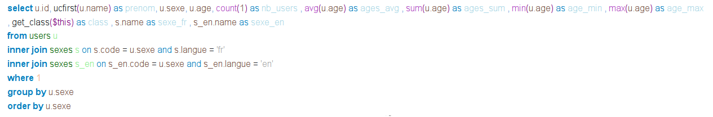

# SQL Engine made in PHP

### Parse and execute SQL query against PHP arrays
 
 

No dependencies.


## Usage

```php
require __DIR__ . '/vendor/autoload.php';

use \SqlParser\SqlParser;


$database = [
    'users' => [
        ['id' => 1, 'name' => 'pierre' , 'age' => 42, 'sexe' => 'm'],
        ['id' => 2, 'name' => 'paul'   , 'age' => 49, 'sexe' => 'm'],
        ['id' => 3, 'name' => 'jacques', 'age' => 53, 'sexe' => 'm'],
        ['id' => 4, 'name' => 'alain'  , 'age' => 59, 'sexe' => 'm'],
        ['id' => 5, 'name' => 'elodie' , 'age' => 38, 'sexe' => 'f'],
        ['id' => 6, 'name' => 'marion' , 'age' => 42, 'sexe' => 'f'],
    ],
];


$sql = "select * from users order by age, name desc";

$parser = new SqlParser($sql, $database);

// execute query
$rows = $parser->execute();

// display an HTML table
$parser->showResults();

```

### Results
|id|name|age|sexe|
|--|:--:|:-:|:--:|
|5|elodie|38|f|
|1|pierre|42|m|
|6|marion|42|f|
|2|paul|49|m|
|3|jacques|53|m|
|4|alain|59|m|


<br/><br/>

## Advanced

```php

$database = [
    'users' => [
        ['id' => 1, 'name' => 'pierre', 'email' => 'pierre@email.com', 'age' => 42, 'sexe' => 'm'],
        ['id' => 2, 'name' => 'paul', 'email' => 'paul@email.com', 'age' => 49, 'sexe' => 'm'],
        ['id' => 3, 'name' => 'jacques', 'email' => 'jacques@email.com', 'age' => 53, 'sexe' => 'm'],
        ['id' => 4, 'name' => 'alain', 'email' => 'jacques@email.com', 'age' => 59, 'sexe' => 'm'],
        ['id' => 5, 'name' => 'elodie', 'email' => 'elodie@email.com', 'age' => 38, 'sexe' => 'f'],
    ],
    'sexes' => [
        ['langue' => 'fr', 'code' => 'f', 'name' => 'Femme'],
        ['langue' => 'fr', 'code' => 'm', 'name' => 'Homme'],
        ['langue' => 'en', 'code' => 'f', 'name' => 'Woman'],
        ['langue' => 'en', 'code' => 'm', 'name' => 'Man'],
    ],
];


$sql = "select id, ucfirst(name) as prenom, sexe, age, count(*) as nb_users
, avg(age) as ages_avg
, sum(age) as ages_sum
, min(age) as age_min
, max(age) as age_max
, get_class(\$this) as class
-- , file_get_contents('https://min-api.cryptocompare.com/data/price?fsym=BTC&tsyms=EUR') as prix_btc
, s.name as sexe_fr
, s_en.name as sexe_en
from users u
inner join sexes s on s.code = u.sexe and s.langue = 'fr' 
inner join sexes s_en on s_en.code = u.sexe and s_en.langue = 'en'
where 1
-- and age < 53
-- and sexe = 'm'
group by sexe
order by sexe
--  limit 1";
```


### Rebuilded query (see example in [example2.php](example2.php#L117))



### Results
|id|prenom|sexe|age|nb_users|ages_avg|ages_sum|age_min|age_max|class|sexe_fr|sexe_en|
|--|:----:|:--:|:-:|:------:|:------:|:------:|:-----:|:-----:|:---:|:-----:|:-----:|
|5|elodie|f|38|1|38|38|38|38|SqlParser\SqlExpr|Femme|Woman|
|4|alain|m|59|4|50.75|203|42|59|SqlParser\SqlExpr|Homme|Man|


<br/><br/>
<br/><br/>

## TODO next

#### Features

- subqueries
- variables SQL @myvar
- distinct
- jointures (à améliorer)
- order by grouped field or by alias
- order by 1
- other actions (update, delete, insert, set, desc)
- insert into ... select ...
- create table ... as select ...
- value in (x, y, z)
- join with using


#### Data Structure ( a revoir)

  - SqlParser
    - SqlAction
        - SqlActionPart & SqlActionPart*
          - SqlExpr & SqlParenthese
            - SqlField
            - SqlWord
            - SqlString
            - SqlNumeric
            - SqlJoker
            - SqlOperator
            - SqlComparator
            - SqlSpace
            - SqlComma
            - SqlComment


